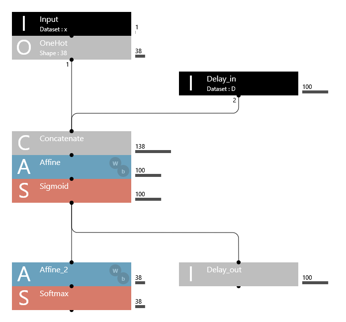
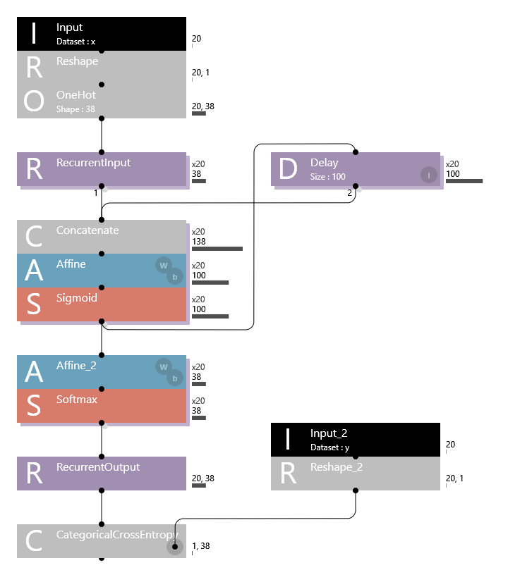
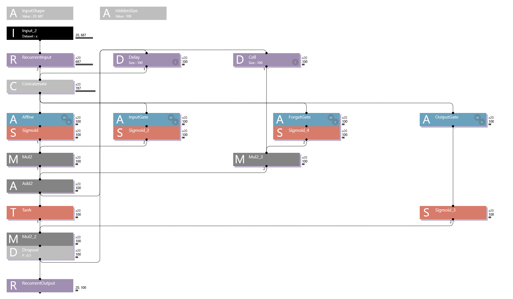
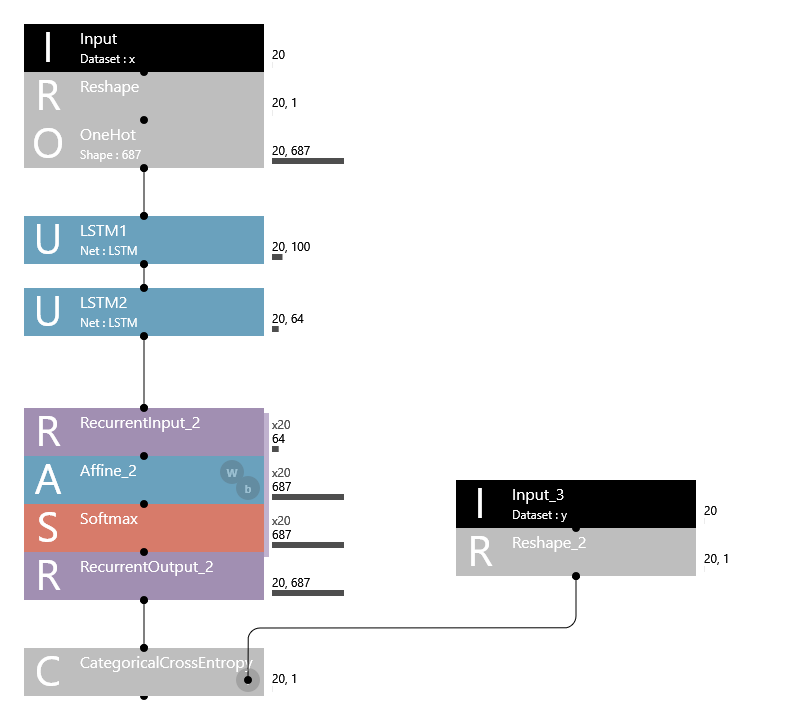
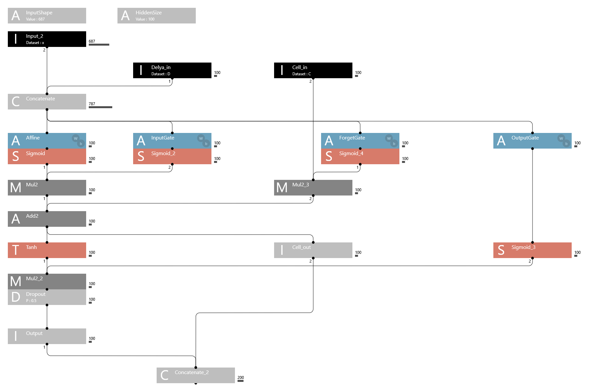
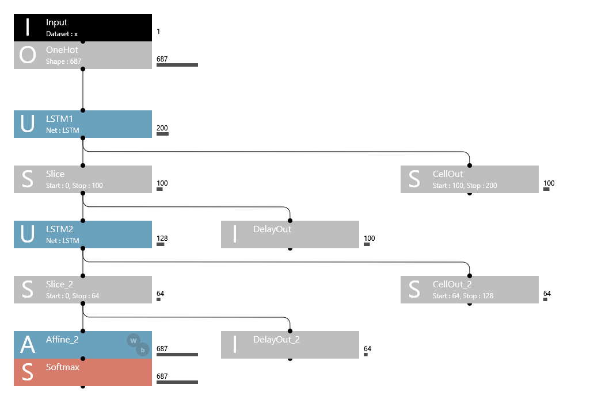

# RNNGenSpeech
RNNの使用例として、有名なスピーチテキストをお手本に、同じような文章を自動生成してみます。
問題設定や前処理方式は「 [KerasのSingle-LSTM文字生成サンプルコードを解説](https://qiita.com/YankeeDeltaBravo225/items/487dbfa1bef02bcfb84c)」を参考にしました。
文章生成では文を単語列として扱うのが一般的ですが、前処理が面倒なのと日本語を対象にしたいので、あえて文字単位で処理します。
作りたいネットワークは例えば以下のようなものです。



Inputは一文字分の"文字コード"を読み込みます。文字コードは、お手本テキストの中に出現する文字を整数でコード化したものです（この図の例では0~37の整数で表現）。

OneHotは、文字コードをOne Hot形式の長さ38のデータに変換します。

Delay_inは、このネットワークが一つ前の文字を処理した際の隠れ層の出力を読み込みます。長さは隠れ層のサイズ（この例では100）になります。

Concatenateは、OneHotとDelay_inのデータを連結して長さ138のデータとします。
これをAffineによって長さ100にして、Sigmoidを通します。

Sigmoidの結果は２つに分岐して、１つは次の文字の処理のためのデータ(Delay_out)として出力し、もう１つは出力層を通して38個の文字コードに分類します。分類結果は38種類の文字の生成確率分布になり、読み込んだ１文字に対して次の文字を生成するために使います。

実際に文字列を生成するためには、このネットワークをPythonコードとしてExportして、前後に処理を付加する必要があります。
前処理では、一文字前に出力した文字のコードと、隠れ層の出力データを覚えておいて、このネットワークに入力します。
後処理では、ネットワークから出力された確率分布を使って生成する文字コードをランダムに決定し、それを実際の文字に変換してprintします。

## 訓練方式
以下の２種類を比較できるようにしてあります。
- 一文字方式：お手本テキストの中の、20文字を読んで21文字目を推定するように学習
- 各文字方式：お手本テキストの中の、20文字を読んで、各文字の次の文字を推定するように学習

どちらの訓練方式でも、推論時は１文字読んで次の文字を推定します。
各文字方式の方が、同じ数の訓練データに対して訓練効率が高いようです。

## 訓練ネットワーク
各文字方針の場合、訓練時のネットワークは以下になります。



全体は、典型的なRNNであるElmanネットの構造になっています。

入力層では、長さ20の入力の各文字コードをOne Hot形式に変換して、20×38のデータとします。

Sony Neural Network ConsoleでBack-Propagation through time(BPTT)を行う場合、繰り返し部分を「RecurrentInput」と「RecurrentOutput」で囲みます。隠れ層のデータはDelayを使って次の文字の処理の入力とします。RecurrentOutputは、20文字分の処理結果を２次元配列20×38で出力します。

評価関数CategoricalCrossEntropyは、推定データが２次元の場合には正解データも２次元でなければならないので、正解データyを20×1の２次元データに変換します。

## LSTM(Long Short-Term Memory)

上野千鶴子さんの東大入学式祝辞をお手本とすると出現する文字が687種類もあり、さすがに学習が苦しくなったので、LSTMを使ってみました。Elmanネットの隠れ層をLSTMに移行する方法は、[Sonyの小林さんの講演資料](https://www.slideshare.net/Sony_Neural_Network_Console_Libraries/20180227recurrentneuralnetworks)を参考にさせていただきました。

やってみるとかなりの性能向上が得られたので、LSTM隠れ層を２層にすることにしました。このために、LSTM部分はUNIT機能を使って部品化することにしました。

## LSTM Unit(訓練時)
以下が、LSTM部分のサブネットワークです。



サブネットワークのパラメタは以下の２つです。
 - InputShape：入力サイズ（デフォルト： 20×687）
 - HiddenSize：隠れ層のサイズ（デフォルト： 100）

また、最後にDropoutも追加してあります。

## LSTMネットワーク（訓練時）
以下が、LSTM Unitを利用した３層ネットワークです。



１つ目のLSTM層のサイズは100、２つ目は64です。

LSTM Unit内でDelayを使うためには、RecurrentInputとRecurrentOutputで囲む必要があるので、出力は20×64の２次元データになります。そこで出力層でももう一度RecurrentInputとRecurrentOutputで囲んで処理しています。これによって、Affine_2において、64×687の重みを20回分共有できます。RecurrentInputとRecurrentOutputで囲まないで単純にAffineを通すと重みが20×64×687個になってしまいます。

## LSTM Unit(推論時)
ネットワークをPythonコードにexportすると、Unitはサブ関数に変換され、Mainネットワークのコードから呼び出されます。
LSTM UnitはDelayが２箇所あるので、３入力２出力の関数にする必要があります（３出力のうち２つは同一なので）。
３入力のサブネットワークを定義するにはInputを３つ置けばよいのですが、出力は１つしかできません。
そこで、出力したい２つのデータをConcatenateで連結して出力します。
以下が、推論時のLSTM部分のサブネットワークです。



このサブネットワークをPythonコードとしてExportすると以下のような関数になります：

```
def network_LSTM(x, D, C, InputShape, HiddenSize, test=False):
```

## LSTMネットワーク（推論時）
以下が、推論時の３層ネットワークです。



LSTM Unitの後でSliceを使って、出力を２つに分離しています。

## テキスト生成例
テキスト生成では、初期文字列を与えます。
例えば「入学おめでとうございます．」の13文字を与えると、この文字を１つずつ推論用ネットワーク与えて動作しますが、printするのは与えられた初期文字列中の次の文字です。
最後の「．」の処理後に、ネットワークが出力した確率分布を使って次の文字を決め、それ以降は生成した文字をネットワークに与えて処理を続けます。

以下の生成例で*太字の部分*が初期文字列です。

- *入学おめでとうございます．*少子高齢化が進むことによって誰が困るのですから，女性の男子学生が男子学生は男子学生５人が，私大の女子学生は答えに躊躇するのでしょうか．それはパキスタンにとっては重要だが，日本には無関係でしょうか．それを育だを育さかりすから，「東京，のですが，保育園が足りないというのは納めた人が受け取れること，医学部を除く他学部では，女性は多かかげです．また広告などで性差別的な表現をすることに誇りが持てるのに，女性の価値と成績のよさとのあいだには，ねじれがあることを求める思想です．あなたたちは疑っておられないと言っても，仲間を作れば怖くはありません．逆に言えば孤立したら負けです．日本社会は差別のせいで，せっかくの人材を失っています．これまであなたたちが過ごしています．あなたたちは激烈な競争を勝ち抜いてこの場に立たせたことが，なんらますからです．これまであなた方は正解のある知を求めてきたの？大学とは，がんばってもそれを求めたからです．学部には，女子学生排除は「東大憲章」が唱える平等の理念に反すると警告を発しました．これまであなたたちは疑っておられないというのは納めた人が受け取れるのは，女性の価値と成績のよさとのあいだには，ねじれがあります．今の日本は少子高齢化と不景気に苦しんでいますから，「東大憲章」が唱える平等の理念に反すると警告を発しました．も育婦の育休を３年にしようと発言した理由の一つは，この１番不足しており，もっともにしているから，女性の価値と成績のよさでもなわれたらさす」と訊かれたら，「東大憲章」が唱える平等の理念に反すると警告を発しました．女性運動の世代交代ですね．今の社会ではネットに出ていないというということを証明しています．女性学によって出生率が下がるのは食い止めることができません．例えば多くの看護師さんは３年も休んだら現場に戻れないと言ます．女性学によっておらしたかというということは研究かしきいから「かわいい」とはどんな価値でしょうか？全国医学部調査結果を公表した文科省の担当者が，これまで，娘は短大まで」でよいと考える親の性差別の結果です．ですが，女性はありません．最近ノーベル平和賞受賞者のマララ・ユスフザイさんが日本を訪れて「女子教育」の必要性を訴えました．それが男子学生は答えに躊躇するのでしょうか．それが半世紀後の今日も

- *パキスタンにとっては重要だが*，日本には無関係でしょうか．「どうせ女の子だし」「しょせん女の子だから」という言葉を使うのは，それと同じ条件で仕事をしており，育児休暇を取得する権利がありません．最近ノーベル平和賞受賞者のマララ・ユスフザイさんが日本を訪れて「女子教育」の必要性を訴えました．それはパキスタンにとっては重要だが，日本には無関係でしょうか．「どうせ女の子だし」「しょせん女の子だから」という小説を書き，昨年，東大学とは，東京大学理科３類は１．０３，平均よりは低いですが１．０よりは高い，この数十年間の日本のネオリベラリズム改革の過程で男女格差だけでなく，東京大学理科３類は１．０３，平均よりは低いですが１．６７，上位には昭和大，日本大，慶応大などの地方国立大医学部が並んでいます．３歳児以上は保育所が足りないというのは０歳児から３歳児まで，保育所や幼稚園のような環境で子供の社会性を育てることには，女性の価値と成績のよさとのあいだには，ねじれがあります．女子学生が男子学生は浪人を避けるために余裕を持って受験先を決める傾向があります．第２に東京大学は大学とでは，主婦の研究でも，少女マンガの研究でもセクシュアリティの研究でも学位がとれます．その先，研究職となるというのは０歳児保育，病児保育，延長保育，それと夜間保育です．保育所は原則５時までで，それは仕事で女は家事，ってもかですが，あなたたちは疑っておられないともそしたとことを，意欲の冷却効果と言います．女性学には昭和大，日本大，慶応大などの私学が並んでいます．これによって若者が年金を負担する率が大きくなるという小説を書き，昨年，東京医科大不正入試問題が発覚し，女子学生の入りにくさ，すなわち女子学生の方が男子サークルがあると聞きました．「彼女は頭が悪いから」というのは，それと同じくらいます．これはそれを望んでいません．そうやって東大に頑張って進学した男女学生を待っているのは，作りました．女性学は，大学でも，どこでも生きているという作家が「彼女は頭が悪いから」というのは，それが選児なしない問いに満ちた世界です．これまであなたたちは疑っておられないというのは間違った考えです．本来年金というのは納めた人が受け取れるのであれば，怒りが湧くでしょう．子供と２４時間ずっと一緒に過ごしています．東大工学部と大学院の男子学生５人が

## ファイル一覧
### pythonコード
- create_RNNtrain_data.py：テキストファイルから一文字方式の訓練データを作成
- create_RNNtrain_dataW.py：テキストファイルから各文字方式の訓練データを作成
- show_dict.py：文字コード辞書の中身を確認
- traindata2str.py：訓練データの中身を確認（両方式とも利用可能）
- output2str.py：一文字方式での訓練で作成されたoutput_result.csvをコード変換して確認

- generate_text.py：Elman型のネットワークで推論（テンプレート）
- generate_text_LSTM.py：LSTM１層のネットワークで推論（テンプレート）
- generate_text_2LSTM.py：LSTM２層のネットワークで推論（テンプレート）

- make_dict.py：文字コード辞書作成ライブラリ

### サンプルテキスト
- ObamaHiroshimaSpeech.txt：オバマ元大統領の広島スピーチ全文
- SteveJobsStanford.txt：ジョブズのスタンフォード大学でのスピーチ全文
- UenoTodaiSpeech+.txt：上野千鶴子の東大入学式祝辞スピーチ全文＋α

### 生成したファイルのサンプル
- ObamaHiroshimaSpeech.pkl：オバマ元大統領スピーチの文字コード辞書
- UenoTodaiSpeech+.pkl：上野千鶴子東大入学式祝辞の文字コード辞書
- OHS_train.csv：オバマ元大統領スピーチの一文字方式の訓練データ
- OHS_test.csv：オバマ元大統領スピーチの一文字方式のテストデータ
- OHSW_train.csv：オバマ元大統領スピーチの各文字方式の訓練データ
- OHSW_test.csv：オバマ元大統領スピーチの各文字方式のテストデータ
- UenoW_train.csv：上野千鶴子東大入学式祝辞の各文字方式の訓練データ
- UenoW_test.csv：上野千鶴子東大入学式祝辞の各文字方式のテストデータ
- generate_text_2LSTM_ueno.py：上野千鶴子東大入学式祝辞学習したLSTM２層のネットワークで推論
- result_train.nnp：Sony Neural Network Consoleクラウド版でUenoW*.csvを5000epoch学習した結果

### その他
- README.md：このファイル
- ElmanNet4Inference.png：このファイルの画像データ
- ElmanNet4Train.png：このファイルの画像データ
- LSTMUnit4Inference.png：このファイルの画像データ
- LSTMUnit4Train.png：このファイルの画像データ
- 2LSTMNet4Inference.png：このファイルの画像データ
- 2LSTMNet4Train.png：このファイルの画像データ
